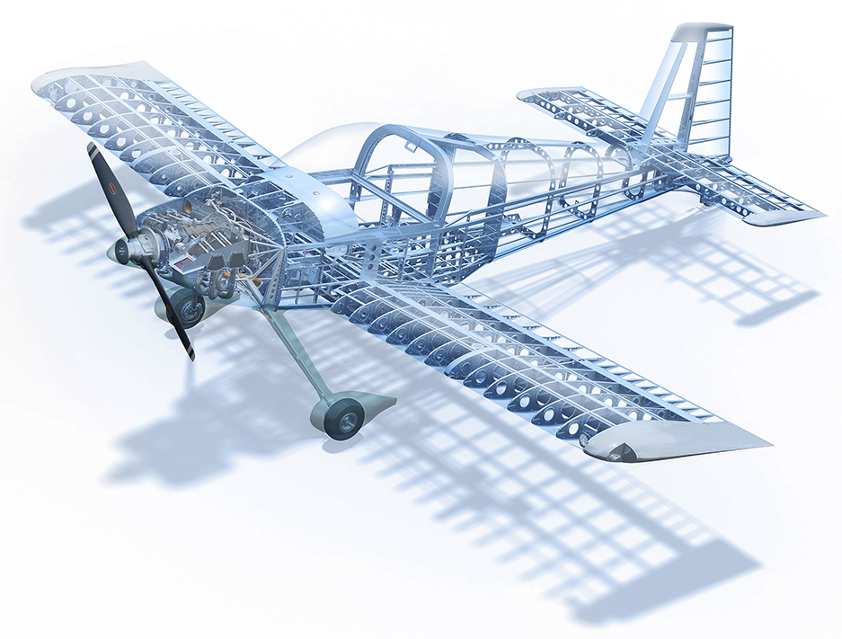
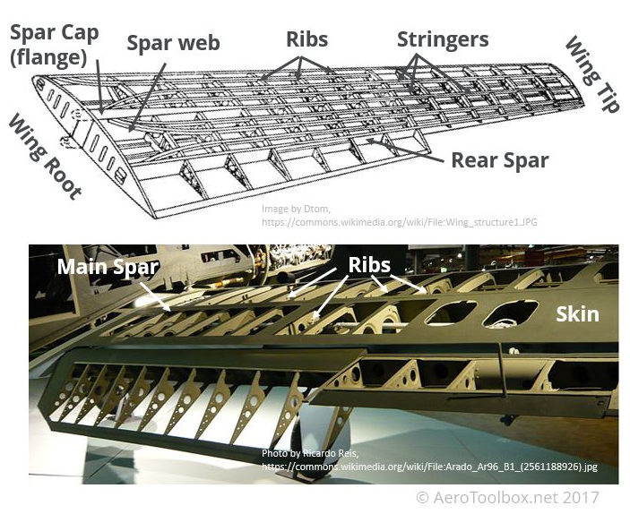

#+title: AS3020: Aerospace Structures
#+subtitle: Jul-Nov, 2024
#+date: {{{time(%Y-%m-%d)}}}
#+startup: indent
#+html_head_extra: 
#+html_head_extra: <meta name="viewport" content="width=1024">
#+setupfile: ./theme.setup

* Introduction
:PROPERTIES:
:CUSTOM_ID: intro
:END:
#+begin_lmargin 
#+attr_html: :frame border
#+caption: A few shortcuts to help navigate the site
| n, p | Next/Prev tab               |
| <, > | Scroll to top/bottom        |
| -, + | Collapse/expand all         |
| c, e | Collapse/expand subheadings |
#+end_lmargin

#+begin_rmargin
#+attr_html: :style width:100%; :alt Aircraft Structures for Engineering Students, T.H.G. Megson
#+name: megson
#+caption: Course Textbook: "Aircraft Structures for Engineering Students", T.H.G. Megson
[[https://shop.elsevier.com/books/aircraft-structures-for-engineering-students/megson/978-0-12-822868-5][file:files/megson.jpg]]
#+end_rmargin
** Instructor, TA, and the basics
+ [[file:../../index.org][Dr. Nidish Narayanaa Balaji]]
  + [[mailto:nidish@iitm.ac.in][nidish@iitm.ac.in]], Room 139 AE building
+ *TA*: TBD
+ *Textbook Reference*: "/Aircraft Structures for Engineering Students/", T.H.G. Megson

  #+html: <embed src="./files/July-2024_final_timetable_R1.pdf" width="80%" height="375">

** Some Planning
+ The lectures will be split into *eight modules*:
  | SNo. | Topic                         | Lectures | Assignments |
  |------+-------------------------------+----------+-------------|
  |    1 | [[#mod1][Design of Aircrafts]]           |        3 |           1 |
  |    2 | [[#mod2][Aircraft Materials]]            |        3 |           1 |
  |    3 | [[#mod3][Elasticity]]                    |        5 |           1 |
  |    4 | [[#mod4][Bending of Beams]]              |        6 |           1 |
  |    5 | [[#mod5][Torsion of Beams]]              |        5 |           1 |
  |    6 | [[#mod6][2D Problems and Plate Bending]] |        5 |           1 |
  |    7 | [[#mod7][Structural Stability]]          |        3 |           1 |
  |    8 | [[#mod8][Structural Vibrations]]         |        2 |           1 |
  |------+-------------------------------+----------+-------------|
  |      | *Total*                       |       32 |           8 |
  #+TBLFM: @>$4=vsum(@3..@10)::@>$3=vsum(@3..@10)
+ We have a total of *65 working days* ahead of us. The weekly splitup is:
  + *3 Lectures*: _~39 in total_
  + *1 Tutorial With Faculty*: _~13 in total_
  + *1 Extended Tutorial With TA*: _~13 in total_
** Evaluation Rubrics

#+begin_lmargin
#+begin_note
*Honor Code Policy* \\
You are required to sign an _honor code_ for each submission, failing
which *evaluation will not be done*. 
#+end_note
#+end_lmargin
+ *Honor Code*
  #+attr_html: :style background:yellow;outline:2px solid;padding-left:1vw;padding-right:1vw;padding-top:0.01vh;padding-bottom:0.01vh;
  #+begin_quote
  Upon my honor I state that I have received no unauthorized support
  and can attest that the submission reflects my understanding of the
  subject matter.
  #+end_quote

+ *One assignment will be given for each module* due in _one week from
  the date of posting_.
  + Each assignment will include *2 numerical/analytical exercises*
    and *one reading exercise*.
+ *Two Quizzes and an End Sem* occupy the examination portion.
  | Evaluation | Assignments | Quizzes | End-Sem |
  |------------+-------------+---------+---------|
  |  Weightage |     40%     |   40%   |   20%   |
+ *Project?* [[color:red][No projects.]]

** Useful Links
+ [[file:files/July-2024_final_timetable_R1.pdf][Weekly timetable]]
+ [[file:files/Calendar.pdf][Semester Calendar]]

+ [[https://aerospaceengineeringblog.com/aircraft-structures/][A brief history of aircraft structures]]
+ [[https://www.grc.nasa.gov/www/k-12/VirtualAero/BottleRocket/airplane/geom.html][Wing Geometry Definitions]]
+ [[https://aerotoolbox.com/wing-structural-design/][Wing Structural Design]]
+ [[https://www1.grc.nasa.gov/beginners-guide-to-aeronautics/foilsimstudent/][Interactive Javascript Airfoil Simulator]]
  + [[https://www1.grc.nasa.gov/beginners-guide-to-aeronautics/bga-simulations/][More Interactive Simulators]]
      
* Module 1: Design of Aircrafts
:PROPERTIES:
:CUSTOM_ID: mod1
:END:
** Overview
#+begin_lmargin
#+attr_html: :style width:80%;
#+caption: A400m structure
[[https://aerospaceengineeringblog.com/aircraft-structures/][file:files/mod1/A400m.jpg]]
#+end_lmargin
+ *Fuselage construction*
  + Stressed skin design
  + monocoque, semi-monocoque, etc.
  + Pressurized vs un pressurized design
  + Stringers and stiffeners.
    #+attr_html: :style width:80%;
    #+caption: RV14 Cut-away
    
+ *Wing construction*
  + Shape requirements: lift generation from airfoil. 
  + Wing ribs, spars, etc.
    #+attr_html: :style width:80%;
    

    # #+begin_rmargin
    # #+attr_html: :style :width:10vw;
    # #+caption: Loads during maneuvers
    # [[https://fly8ma.com/topic/aircraft-load-factor/][file:files/mod1/loads3.jpg]]      
    # #+end_rmargin

    #+begin_lmargin
    #+attr_html: :style :width:80%;
    #+caption: wing-loading
    [[https://aerospaceweb.org/design/ucav/structures.shtml][file:files/mod1/loads2.jpg]]
    #+end_lmargin
+ *Loads on the different members.*
  + Load distribution. Discuss loads for different maneuvers.
  + Load envelopes (V-n diagrams).
  + Relate global loads to local loads on members.
  + Airworthiness.
    #+attr_html: :style width:80%;
    #+caption: Loads overview
    [[https://m.youtube.com/watch?v=WoolUTm7-5g][file:files/mod1/loads1.jpg]]

    #+begin_lmargin 
    #+attr_html: :style width:100%;
    [[https://ultralightdesign.wordpress.com/2017/11/24/riveting-stuff/][file:files/mod1/rivet-figure1.png]]
    #+end_lmargin
+ *Joining Processes*
  + Screwing, Bolting, Riveting, Welding.
  + Rivets over bolts: blind riveting, resistance to vibration,
    "permanence", etc.
  + Riveting process.
  + Bolt-load distribution calculations.
  + Other joining methods.
    #+attr_html: :style width:60%
    [[https://www.goebelfasteners.com/why-are-airplanes-manufactured-with-riveted-joints-instead-of-welded/][file:files/mod1/rivets.png]]
** Lecture 1
*** Historical Overview
+ [[https://www1.grc.nasa.gov/beginners-guide-to-aeronautics/wright-brothers-aircraft/][The Wright Brothers aircraft]]
  + Wooden design
  + [[https://en.wikipedia.org/wiki/Sopwith_Camel][1917 Sopwith Camel]]
+ Warren Truss designs
  + Struts: support longitudinal compression
  + Truss frame carried the load, skin was just for aerodynamics
+ Monocoque design

* Module 2: Aircraft Materials
:PROPERTIES:
:CUSTOM_ID: mod2
:END:
** Overview
+ *Understanding the stress-strain curve.*
  + Elastic regime, plastic yield, proof load, failure, elongation at failure, toughness, etc.
  + Strain hardening.
+ *The need for alloys.*
  + Show dramatic difference between raw Al and Al-alloy. Raw Fe & steels.
  + Outline basic considerations.
  + Examples of some common alloys with historical context.
+ *Fatigue.*
  + Failure at stress levels way below yield through repeated application.
  + Show S-n curves. Contrast behavior of Steel and Al-alloys.
  + Motivate the study of vibrations.

#+attr_html: :style width:100%;
[[https://www.youtube.com/watch?v=xQHz3MsHHwo][file:files/mod2/sstrain.jpg]]    
* Module 3: Elasticity
:PROPERTIES:
:CUSTOM_ID: mod3
:END:
** Overview
+ *Fundamentals*
  + Use the stress-strain curve to motivate $\epsilon=\frac{\sigma}{E}$ and go into elasticity.
+ *Stress*
  + Derive stress-balance => governing equations.
  + Stress Mohr's circle.
+ *Strain*
  + Introduce strain. Constitutive relationship.
  + Strain compatibility. 
+ *Thermo-elasticity outline.*
+ *Introduction to 2D Problems.* Will revisit in [[#mod6][Module 6]].
+ _Has tensor notation already been introduced?_ [[color:red][We will not be using tensor notation.]]

* Module 4: Bending of Beams
:PROPERTIES:
:CUSTOM_ID: mod4
:END:
** Overview
+ *Motivate by applications (wings, wing spars, etc.).*
+ *Beam theory assumptions* and justifications (stringer-stiffeners, shape-preservation).
+ *Unsymmetrical bending of solid beams (wings).*
+ *Shear of thin-walled beams (wing sections).*
  + Open sections, closed sections.
  + Multi-cell closed/open combination sections.

#+attr_html: :style width:100%;
[[https://www.youtube.com/watch?v=_ZMXNg6tJRg][file:files/mod4/thinsec.jpg]]
* Module 5: Torsion of Beams
:PROPERTIES:
:CUSTOM_ID: mod5
:END:
#+begin_lmargin 
#+attr_html: :style width:100%;
[[https://www.youtube.com/watch?v=_ZMXNg6tJRg][file:files/mod4/thinsec.jpg]]
#+end_lmargin

+ *Solid section torsion.*
  + Prandtl stress function.
  + Warping of section.
  + Discussion of physicality.
    + Mention St. Venant's principle, will revisit in [[#mod6][Module 6]].
+ *Thin-walled torsion.*
  + Closed section, open section.

#+attr_html: :style width:60%;
[[https://www.jpe-innovations.com/precision-point/torsion-leaf-springs-restrained-warping/][file:files/mod5/twarp.png]]
    
* Module 6: 2D Problems and Plate Bending
:PROPERTIES:
:CUSTOM_ID: mod6
:END:
+ *2D elasticity*. Derive bi-harmonic equation for stress function.
  + Contextualize St. Venant's principle based on "diffusion" of the bi-harmonic PDE.
+ *Bending of plates.*
+ *Revisit torsion.*
  + Membrane analogy.

#+attr_html: :style width:80%;
[[https://www.youtube.com/watch?v=250JVflPsOA][file:files/mod6/plates.jpg]]
  
* Module 7: Structural Stability
:PROPERTIES:
:CUSTOM_ID: mod7
:END:
+ *Column buckling.*
  + Derive governing equation for column-buckling.
  + Sturm-Liouville ODE.
  + Euler buckling analysis.
+ *Plate buckling.*
  + Write down governing equation (derivation left for self study).
  + Show examples from aircrafts.
  + Possibility and avenue for thermal buckling from governing
    equations.
    
    #+attr_html: :style width:80%;
    [[https://aeropeep.com/does-this-aging-bomber-have-wrinkles/][file:files/mod7/wrinkl.jpg]]
    
* Module 8: Structural Vibrations
:PROPERTIES:
:CUSTOM_ID: mod8
:END:
+ *Dynamic elasticity equations.*
+ *Dynamics of beams*. Derive governing equations.
  + Solve by method of variable separation.
  + The Sturm-Liouville problem.
+ Eigenfunctions and eigenvalues.
+ Introduce a linear viscous damping to the PDE and show influence of
  damping on response. 
+ Visualize mode-shapes for realistic models and motivate the need for
  *fillets and chamfers* from a fatigue standpoint. 
  + St. Venant doesn't help us for fatigue!

#+attr_html: :style width:80%;
[[https://aeropeep.com/aircraft-vibrations/][file:files/mod8/vibns.png]]

* Footer Scripts                                                     :ignore:
#+begin_export html

#+end_export
